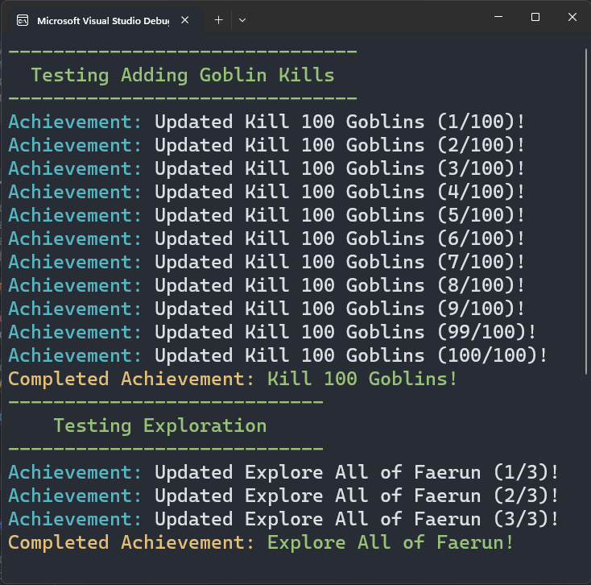

# Achievement System Idea

## Short Explanation
This is a simple mockup of an achievement system that is event driven and aims to decouple components like the `AchievementItem` and `ProgressBar` from the UI and other future systems.

It works by having the `AchievementItem` itself dictate the progress of the `ProgressBar` and emit events any time the progress bar updates or the achievement completes, managed by the `OnUpdate()` and `OnComplete()` event delegates which other systems can subscribe to by getting the `AchievementItem` from the `AchievementSystem` dictionary.

**Do Note** that this is probably over-engineering and I may have no idea what I'm talking about since I'm just a hobby programmer lol.